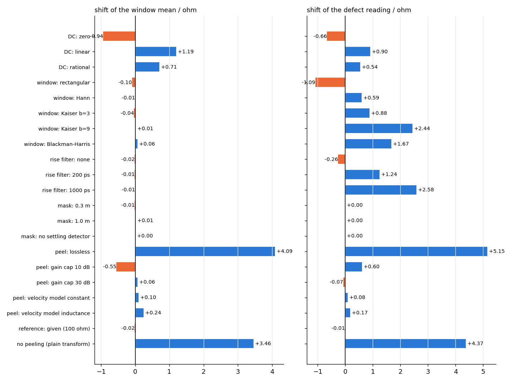

\newpage

# Purpose

A cable's characteristic impedance should be the same at every point along its length. Where it is not, a signal is partly reflected, the return loss suffers, and the eye at the receiver closes. Dedicated time-domain reflectometers show the impedance-versus-distance trace directly; a vector network analyser (VNA), which the laboratory has anyway, can produce the same trace by transforming the measured reflection coefficient $S_{dd11}(f)$ into the time domain. The transform is cheap and fast, but every step of it is a choice — how to fill the gap between DC and the first measured frequency, how to taper the band edge, which rise time to emulate, where the connector ends and the cable begins — and every choice moves the number that is read off the trace.

This project delivers three things. First, a *reconstruction engine*: not just the transform, but a loss-aware layer-peeling algorithm that recovers the geometric impedance $Z(x)$ from the reflection data, removing the three errors that the plain transform commits (transmission loss through earlier mismatches, re-reflections, and the distributed reflection of a lossy line that makes every TDR trace of a real cable slope upwards). Second, a validation against a simulated TDR instrument and against the exact model truth on five reference cables. Third, an honest statement, in ohms, of how much each processing choice shifts the reading — the number an engineer needs when two laboratories disagree by a couple of ohms on the same sample.

The package `zprofile` builds on `cablecheck` (Project A) for file reading, mixed-mode conversion, fixture removal, the fitted-impedance method and the synthetic cable model, and it plugs back into it: `cablecheck` can call `zprofile.compute_profile` in place of its plain profile.

# Why the plain transform is not enough

Let $\Gamma(f)$ be the differential reflection coefficient measured at the near end, referenced to a real $Z_\text{ref}$, on a uniform grid $f_k = k\,\Delta f$, $k = 0..K-1$ (Section 3.1 explains how the grid is made to start at DC). With a window $w_k$ and a rise-time filter $H_k$ the impulse response is the inverse real DFT with zero padding to $N$ points,

$$
h[n] = \frac{1}{N}\sum_{k} \Gamma_k w_k H_k\, e^{+j2\pi kn/N}\ \ (\text{Hermitian completion}),\qquad t_n = \frac{n}{N\Delta f},
$$

the step response is the running sum $r[n] = \sum_{m\le n} h[m]$, and the displayed impedance is

$$
Z(t) = Z_\text{ref}\,\frac{1 + r(t)}{1 - r(t)},\qquad x = \frac{v t}{2}.
$$

This is what every VNA time-domain option and every TDR instrument shows. It is exact for a single mismatch in a lossless line and wrong for everything else, in three ways that all *grow with distance*:

1. **Transmission through earlier mismatches.** The step arriving at a discontinuity at $x$ has passed every earlier discontinuity twice; its amplitude is $\prod_{i}(1 - \rho_i^2)$ times the launched step, so a distant mismatch reads smaller than it is.
2. **Re-reflections.** Energy bouncing between two earlier discontinuities arrives later and is read as a (false) impedance feature further down the cable.
3. **The distributed reflection of a lossy line.** Even a perfectly uniform cable is not reflection-free: with series resistance $R(f) = R_\text{dc} + R_s\sqrt f$ its characteristic impedance is complex and frequency dependent, $Z_0(f) = Z_c\sqrt{1 + R/(j\omega L)}\,/\sqrt{1 + G/(j\omega C)}$. Referenced to the real $Z_c$ the input reflection of a long uniform line is, to first order,
   $$
   \Gamma(\omega) \approx \frac{R(\omega)}{4 j\omega L}\quad\Rightarrow\quad r(t) \propto \sqrt t\ \ \text{for } R \propto \sqrt\omega ,
   $$
   because the inverse Laplace transform of $\omega^{-1/2}$ is $t^{-1/2}$ and the step response integrates it. The trace therefore rises as $\sqrt t$ — on the synthetic 15 m automotive pair by about 1 $\Omega$/m (Figure 1) — and a window statistic taken over the length would fail a perfect cable. A real TDR instrument shows exactly the same rise (Figure 1, orange curve); this is physics, not a transform artefact.

{width=95%}

# The reconstruction pipeline

## Spectrum preparation and the DC gap

A VNA sweep starts at $f_\text{min} > 0$, but the step response needs $\Gamma(0)$ and the samples in $0 < f < f_\text{min}$, and the *level* the trace settles to after each discontinuity depends on how that gap is filled. `zprofile.spectrum.prepare` first puts the data on a uniform grid that contains 0 Hz exactly, then fills the gap by one of four estimators:

* `zero`: $\Gamma = 0$ below $f_\text{min}$ (what a careless script does);
* `linear`: $\operatorname{Re}\Gamma$ extrapolated linearly from the first $n_\text{fit}$ points, $\operatorname{Im}\Gamma$ linearly to zero ($\Gamma(0)$ of a passive one-port is real);
* `rational`: a least-squares fit of the first points to the causal first-order model $\Gamma(f) = (a + jbf)/(1 + jcf)$, $\Gamma(0) = a$;
* `physical`: the DC value from the known DC picture — the far end terminated in $Z_\text{term}$ through the loop resistance $R_\text{loop}$,
  $$
  \Gamma(0) = \frac{R_\text{loop} + Z_\text{term} - Z_\text{ref}}{R_\text{loop} + Z_\text{term} + Z_\text{ref}},
  $$
  with a $\sqrt f$-shaped bridge to the first measured point.

The default (`auto`) uses `physical` and takes $R_\text{loop}$ from the *measurement itself*: the constant term $c$ of the three-term attenuation fit of Section 3.4 is $\alpha_\text{dc} = R'_\text{dc}/(2Z_c)$, so $R_\text{loop} = 2 c Z_c \ell$. On the reference cables this recovers the model's loop resistance to 0.3 % (3.10 vs 3.105 $\Omega$ for 15 m). An operator can also type in a DMM reading. Section 6 shows that the DC choice moves the *plain* reading by up to 2 $\Omega$ and the *reconstructed* level by up to 1 $\Omega$ at 600 MHz, and less at higher bandwidth.

## Windows and their consequences

Truncating the spectrum at $f_\text{max}$ is a rectangular window whose impulse response is a sinc: $-13$ dB side lobes that ring for many cells after every discontinuity, and 9 % overshoot on every step. A window $w(f)$ tapering to zero at $f_\text{max}$ buys lower side lobes with a wider main lobe [@harris1978]. Rather than quoting textbook tables, `zprofile.windows.metrics` computes numerically, for *this* bandwidth, what each window does to a step: the 10–90 % rise time, the peak side lobe of the impulse response beyond the main lobe, the step overshoot and the equivalent noise bandwidth. At 600 MHz with the 500 ps specification filter:

| window | 10–90 % rise | side lobe | overshoot |
|---|---|---|---|
| rectangular | 906 ps | $-16.8$ dB | 4.5 % |
| Kaiser $\beta=3$ | 1324 ps | $-30.9$ dB | 0.4 % |
| Hamming | 1664 ps | $-46.7$ dB | 0.1 % |
| Kaiser $\beta=6$ (default) | 1780 ps | $-55.6$ dB | 0.0 % |
| Chebyshev 70 dB | 2000 ps | $-74.2$ dB | 0.0 % |
| Blackman–Harris | 2436 ps | $-97.3$ dB | 0.0 % |

The default Kaiser $\beta = 6$ is the point where the overshoot drops below 0.1 %, i.e. where ringing can no longer be mistaken for a 0.1 $\Omega$ feature; at 6 GHz the 500 ps filter dominates and all windows give 710–745 ps. The *effective* rise time is computed exactly from the step response of the total filter (window times rise-time filter) — the popular root-sum-square rule $\sqrt{t_w^2 + t_r^2}$ underestimates it by up to 25 % for a Kaiser edge, which is a unit test, and it is never used.

## Rise-time matching

Specifications quote impedance "at 500 ps rise time". A Gaussian low-pass

$$
H(f) = \exp\!\big(-\ln 2\,(f/f_{3\,\text{dB}})^2\big),\qquad f_{3\,\text{dB}} = \frac{0.339}{t_r},
$$

gives the step exactly the 10–90 % rise time $t_r$ (a Gaussian step has $t_{10-90} = 0.339/f_{3\,\text{dB}}$). It is applied to the spectrum before the transform, and it is also what a sampling oscilloscope's "normalise" function does to the instrument trace, so the two paths are compared like with like.

## The loss model from the cable's own transmission

Everything that follows needs the propagation constant $\gamma(f) = \alpha + j\beta$ of the medium between discontinuities. It is extracted from the differential transmission $S_{dd21}$ of the same measurement (`zprofile.propagation.gamma_from_s21`):

$$
\alpha(f) = -\frac{\ln|S_{dd21}|}{\ell},\qquad \beta(f) = -\frac{\varphi_\text{abs}(f)}{\ell},
$$

where $\varphi_\text{abs}$ is the unwrapped phase with the integer number of turns at $f_0$ fixed from the low-frequency group delay (as in Project A). The attenuation is fitted, with non-negative coefficients, to the physical three-term form

$$
\alpha(f) = c + a\sqrt f + b f,
$$

($c$: DC resistance, $a$: skin effect, $b$: dielectric loss), which gives a smooth, noise-free $\alpha$ and the split into conductor-type ($\alpha_c = c + a\sqrt f$) and dielectric-type ($\alpha_d = bf$) loss that the impedance model needs. From $R/(\omega L) = 2\alpha_c/\beta$ and $G/(\omega C) = 2\alpha_d/\beta$ the complex characteristic impedance and the consistent propagation constant are

$$
Z_0(f) = Z_c\,\zeta(f),\quad \zeta(f) = \sqrt{\frac{1 - j2\alpha_c/\beta}{1 - j2\alpha_d/\beta}},\qquad
\gamma(f) = j\beta\sqrt{(1 - j2\alpha_c/\beta)(1 - j2\alpha_d/\beta)} .
$$

Two details matter in practice. The extraction must be done on the 2-port *renormalised to the cable's own characteristic impedance* (Section 3.5): otherwise the mismatch ripple on $|S_{21}|$ is fitted as loss and the reconstruction drifts by up to 2 $\Omega$ over 10 m on a 90 or 120 $\Omega$ cable (observed during development, and the reason for that design decision). And when no transmission measurement exists, a typical automotive-pair model ($a = 2\cdot10^{-6}$ Np/m/$\sqrt{\text{Hz}}$, $b = 2\cdot10^{-11}$ Np/m/Hz) is used and reported as such.

## Reference impedance

The reconstruction is referenced not to the VNA's 100 $\Omega$ but to the cable's own fitted characteristic impedance $Z_\text{fit}$ (the IEC 61156-1 style ripple-averaged $a + b/\sqrt f$ fit of $|Z_\text{in}(f)|$ from Project A). The differential 2-port is renormalised to $Z_\text{fit}$ through the impedance matrix (real reference impedances), the loss is extracted there, and the profile is still reported in absolute ohms. On synthetic 90/100/112 $\Omega$ pairs the reconstruction then tracks the nominal value within 1.5 $\Omega$ (`test_peeling_tracks_other_impedances`).

## Layer peeling with loss

The cable is modelled as a chain of uniform cells of round-trip delay $t_\text{cell}$, i.e. of physical length $\Delta x_k = v_k t_\text{cell}/2$, each a lossy transmission line with characteristic impedance $Z_k$ (a real number, the high-frequency limit) and a propagation constant $\gamma_k$ derived from the measured $\gamma$. Let $G_k(f)$ be the reflection coefficient looking into cell $k$, referenced to $Z_\text{ref}$; $G_0 = \Gamma$. Two steps per cell (`zprofile.peel.peel`):

**Read.** The impedance of the cell is read from the *early* part of the step response of $G_k$:
$$
r_k = \text{step}_k(t_\text{read}),\qquad Z_k = Z_\text{ref}\,\frac{1 + r_k}{1 - r_k},
$$
with $t_\text{read}$ equal to the effective 10–90 % rise time — early enough that the $\sqrt t$ rise has not built up, late enough that the edge has settled. Because a lossy cell's own reflection contributes to the read, $Z_k$ is corrected by two Newton steps on the model "a uniform lossy remainder of impedance $Z_k\zeta(f)$ and length $x_\text{max} - x_k$, terminated in $Z_\text{ref}$", i.e. $Z_k$ is the value for which that model's early read equals $r_k$. (Modelling the remainder as an *infinite* line, whose $Z_0(f)$ diverges at DC, makes the correction unstable; the finite remainder is consistent at DC.)

**Peel.** The two-port of cell $k$ in the $Z_\text{ref}$ system is

$$
S_{11}^{(k)} = \frac{(Z_k^2\zeta^2 - Z_\text{ref}^2)\sinh(\gamma_k\Delta x_k)}{D},\quad
S_{21}^{(k)} = \frac{2Z_k\zeta Z_\text{ref}}{D},\quad
D = 2Z_k\zeta Z_\text{ref}\cosh(\gamma_k\Delta x_k) + (Z_k^2\zeta^2 + Z_\text{ref}^2)\sinh(\gamma_k\Delta x_k),
$$

and the reflection looking into the next cell follows from the exact load-extraction identity

$$
G_{k+1} = \frac{G_k - S_{11}^{(k)}}{S_{11}^{(k)}\big(G_k - S_{11}^{(k)}\big) + \big(S_{21}^{(k)}\big)^2}.
$$

This removes, exactly for the discrete model, the three effects of Section 2: the transmission loss through the cell, the multiple reflections between it and everything before it, and the attenuation, dispersion and distributed reflection of the lossy medium [@bruckstein1987; @hayden1994; @dunsmore2020]. The division by $(S_{21}^{(k)})^2 \sim e^{-2\gamma_k\Delta x}$ is an inverse propagation whose gain $e^{2\alpha(f)x}$ grows with distance and frequency; left alone it amplifies measurement noise without bound. A Wiener-like low-pass

$$
W(x_k, f) = \frac{1}{1 + \big(e^{2\alpha(f)x_k}/G_\text{max}\big)^2},\qquad G_\text{max} = 20\ \text{dB by default},
$$

is imposed on the residual (applied incrementally so that the *total* filter at distance $x_k$ is exactly $W(x_k, f)$, not a product of per-cell filters — a distinction that cost a day). Frequencies whose round-trip attenuation exceeds $G_\text{max}$ are progressively discarded; the resolution therefore degrades gracefully with distance instead of the noise exploding, and because the slower edge would otherwise be read too early, the read time is recomputed from the 10–90 % rise time of the total filter whenever the regularisation has bitten.

**Why does the impedance differ?** A cell whose impedance differs from the reference also has a different velocity and different loss, and the hypothesis matters for the reconstruction: if the change is capacitive (foam density, insulation diameter — the usual case), $C' = C(Z_\text{ref}/Z_k)^2$, so $v_k = v\,Z_k/Z_\text{ref}$, conductor loss scales as $1/Z_k$ and dielectric loss as $Z_k$; if it is inductive the velocity scales the other way. `velocity_model` selects the hypothesis (default `capacitance`), and the cell lengths $\Delta x_k$ accumulate accordingly so that the distance axis stays physical.

## Connector masking

The launch produces the largest features of any profile and none of them are cable. Three mechanisms: explicit fixture de-embedding first (Project A) when fixture files exist; a fixed minimum mask at both ends (0.5 m, and the far end located from the stated length); and a *settling detector* that extends the near-end mask until the plain profile stays within 3 $\Omega$ of its local median for three resolution cells, so that a connector that rings longer than expected does not leak into the statistics. The detected start and the reason are reported.

## Features

Over the un-masked region the profile is summarised by mean, standard deviation, minimum, maximum and the 5/95 percentiles, and two features are extracted for the production-analytics project: the dominant spatial period and amplitude of the de-trended profile (Hann periodogram, restricted to periods longer than two resolution cells — a capstan or extruder-screw signature), and local defects as excursions beyond a threshold from a running median, each with position, depth and extent.

# The simulated instrument and the truth

No TDR head is attached to this project, so the hardware reference is *simulated* from the same multiconductor-transmission-line model that generates the reference cables — but in the way the instrument works, not the way the VNA method works (`zprofile.hwtdr`): the cable model is evaluated from 5 MHz to 20 GHz (4000 points; 200 ns unambiguous range), the instrument's own Gaussian step of 35 ps rise time is the excitation, the DC value is *known* (a real TDR sees DC; the loop resistance of the model is used), white noise of $10^{-3}$ rms in $\rho$ is added, and the displayed trace is normalised to a chosen rise time with a digital Gaussian filter exactly as a sampling oscilloscope does. The truth is the geometric odd-mode impedance of the model, $Z(z) = Z_d/\sqrt{1 + \delta(z)}$, with $\delta$ the relative capacitance deviation.

Five cables span the cases that matter:

| cable | intent |
|---|---|
| `uniform_15m` | perfect 100 $\Omega$ lossy pair: isolates the $\sqrt t$ rise |
| `thin_lossy_15m` | 0.28 mm conductor, $\tan\delta = 0.006$: stresses the loss compensation (10 dB of rise on the plain trace) |
| `section_10m` | 3 m section at 106.6 $\Omega$ from 4 to 7 m: level accuracy of a sustained step |
| `ripple_defect_15m` | 2.5 % capacitance ripple of 0.26 m period plus a Gaussian defect ($\sigma$ = 8 cm, $-10.7\ \Omega$) at 6 m |
| `short_defect_5m` | 3 cm defect of $-13\ \Omega$ at 2.5 m: resolution limit |

# Validation

Two questions are answered separately.

*Does the transform reproduce the instrument?* The plain transform of a VNA sweep is compared with the instrument trace normalised to the *same* effective rise time, so that only the DC gap and the window shape differ. The rms difference over the cable is 0.5–1.4 $\Omega$ on ordinary cables and 2.7–3.5 $\Omega$ on the thin lossy one (Table 1, column "rms vs TDR"); most of it is the DC gap, because the instrument knows $\Gamma(0)$ and the VNA path has to infer it. This validates the transform itself.

*Does the reconstruction reproduce the cable?* The peeled profile is compared with the truth over the un-masked cable.

| cable | data | plain transform | reconstruction | feature (true / read) |
|---|---|---|---|---|
| uniform_15m | 600 MHz | rms 5.45, bias $+4.83$ | rms 0.16, bias $+0.05$ | – |
| uniform_15m | 6 GHz | rms 5.20, bias $+4.78$ | rms 0.24, bias $-0.11$ | – |
| thin_lossy_15m | 600 MHz | rms 10.48, bias $+9.36$ | rms 0.43, bias $+0.21$ | – |
| thin_lossy_15m | 6 GHz | rms 9.88, bias $+9.14$ | rms 0.80, bias $-0.38$ | – |
| section_10m | 600 MHz | rms 4.42, bias $+3.87$ | rms 1.01, bias $+0.40$ | 106.6 / 107.4 $\Omega$ |
| section_10m | 6 GHz | rms 4.55, bias $+4.06$ | rms 1.51, bias $+0.74$ | 106.6 / 108.6 $\Omega$ |
| ripple_defect_15m | 600 MHz | rms 5.17, bias $+4.54$ | rms 1.83, bias $+1.09$ | 89.3 / 92.4 $\Omega$ |
| ripple_defect_15m | 6 GHz | rms 5.23, bias $+4.78$ | rms 0.75, bias $-0.32$ | 89.3 / 88.0 $\Omega$ |
| short_defect_5m | 600 MHz | rms 2.79, bias $+2.34$ | rms 1.38, bias $+0.07$ | 86.7 / 94.7 $\Omega$ |
| short_defect_5m | 6 GHz | rms 3.08, bias $+2.82$ | rms 1.44, bias $-0.65$ | 86.7 / 86.9 $\Omega$ |

Table 1 (all values in ohm, over 0.5 m to $\ell - 0.5$ m; full table with the instrument path in Appendix A).

Three conclusions. The reconstruction removes the loss bias on every cable: from 4–9 $\Omega$ to a few tenths. The *level* is right even at 600 MHz; *features* are read correctly once the bandwidth resolves them — the $\sigma$ = 8 cm defect reads 88.0 against 89.3 $\Omega$ with a 6 GHz sweep and 92.4 with a 600 MHz sweep, and the 3 cm defect reads 86.9 / 86.7 at 6 GHz but 94.7 at 600 MHz, where the resolution cell is 18 cm. And the algorithm is instrument-agnostic: applied to the instrument's own data (band-limited to 6 GHz) it gives the same answers (Appendix A), which is what allows the VNA and the TDR head to be used interchangeably in the laboratory.

{width=95%}

{width=95%}

{width=95%}

# Sensitivity budget: how much each choice moves the reading

`zprofile sensitivity` recomputes the profile of `ripple_defect_15m` with one processing choice changed at a time and reports the shift of the window mean, minimum and maximum, the ripple amplitude and the defect reading. The full tables are in Appendix B; the essentials at the laboratory's 600 MHz bandwidth:

| choice | $\Delta$ mean | $\Delta$ defect reading | comment |
|---|---|---|---|
| DC gap: `zero` / `linear` / `rational` instead of physical anchoring | $-0.9$ / $+1.2$ / $+0.7$ $\Omega$ | $-0.7$ / $+0.9$ / $+0.5$ $\Omega$ | the single largest *level* effect after loss |
| window: rectangular / Kaiser 3 / Kaiser 9 / Blackman–Harris | $\le 0.1\ \Omega$ | $-1.1$ / $+0.9$ / $+2.4$ / $+1.7$ $\Omega$ | windows move features, not the level |
| rise-time filter: none / 200 ps / 1000 ps | $\le 0.05\ \Omega$ | $-0.3$ / $+1.2$ / $+2.6$ $\Omega$ | the specification's 500 ps is a *definition* of the reading |
| connector mask 0.3 m / 1.0 m / no detector | $\le 0.01\ \Omega$ | 0 | irrelevant once the launch is de-embedded |
| loss compensation off (lossless peeling) | $+4.1\ \Omega$ | $+5.1\ \Omega$ | the effect the project exists for |
| no peeling (plain transform) | $+3.5\ \Omega$ | $+4.4\ \Omega$ | |
| gain cap 10 dB / 30 dB | $-0.6$ / $+0.06$ $\Omega$ | $+0.6$ / $-0.1$ $\Omega$ | 20 dB is on the flat part |
| velocity hypothesis constant / inductance | $+0.1$ / $+0.2$ $\Omega$ | $+0.1$ / $+0.2$ $\Omega$ | small for $\pm 5\,\%$ cables |
| reference: VNA 100 $\Omega$ instead of fitted | $-0.02\ \Omega$ | 0 | (this cable is 99.3 $\Omega$; larger for off-nominal cables) |

At 6 GHz every entry except the loss compensation is below 0.8 $\Omega$ for the mean and below 1.7 $\Omega$ for the defect (the 1000 ps filter). The honest summary is therefore: *at 600 MHz the level of a reconstructed profile is reproducible to about $\pm 1\ \Omega$ across all reasonable processing choices provided the loss compensation is on and the DC gap is anchored physically, while the reading of a feature shorter than the 18 cm resolution cell depends on window and rise-time choices by $\pm 2.5\ \Omega$ and must be quoted together with those choices. Without loss compensation the level is wrong by 4–9 $\Omega$ on a 15 m automotive pair, more than the whole $\pm 5\,\Omega$ specification window.*

{width=100%}

# What did not work, and what was learned

*Reading the step at $t = 0$.* The first version of the peeling read every cell at the effective rise time but the step response was summed from $t = 0$. The windowed impulse response of an edge at the reference plane is symmetric about $t = 0$, so half of it sits at negative time, which the DFT wraps to the end of the array; the read caught only ~53 % of each step and the reconstruction decayed geometrically after every sustained step (the section read 103 → 100 within a metre). The fix — start the running sum a few resolution cells before $t = 0$ in signed time — is now also in Project A's transform. The naive fix, adding the entire wrapped half of the array, is *wrong* for a lossy cable because the $\sqrt t$ tail aliases into it; that version added +6 $\Omega$ of bias before it was replaced.

*Complex $Z_0$ in the cell without a DC-consistent read model.* Using $Z_k\zeta(f)$ in the cell and correcting the read against an *infinite* lossy line diverged (bias $-35\ \Omega$ at 6 GHz) because $Z_0(f)\to\infty$ at DC for an infinite line while the measured cable, being finite and terminated, has a small $\Gamma(0)$. The finite-remainder model fixed it.

*Per-cell regularisation.* Multiplying the residual by a per-cell filter accumulates to a product that is far stronger than intended; the effective resolution collapsed to 12–19 ns and the level drifted. The regularisation is now imposed as a total filter for the current distance.

*Model-based refinement.* A regularised Gauss–Newton refinement of the peeled profile (`zprofile.refine`, forward model = the same chain of cells, weighted data misfit plus a second-difference smoothness prior, finite-difference Jacobian) reduces the *data* misfit by a factor of 3–20, and it removed the overshoot after under-resolved features in early tests. It is nevertheless not used by default: on a perfectly uniform cable it moves the level by $+2.4\ \Omega$ while fitting the data better, because the cell model reproduces the distributed loss reflection of a real line only to first order in $\alpha/\beta$, and the optimiser converts that model error into impedance. A version with the exact lossy-line cell (frequency-dependent $R$, $L$, $G$, $C$ per cell) is the right continuation; the module is kept, documented as experimental, with a test that only checks that it runs and reduces the misfit.

# Limitations

* The residual after reconstruction is dominated by the one-pass nature of the estimator: an under-resolved feature leaves a one- or two-cell over/undershoot behind it (up to 8 $\Omega$ for one cell at the edges of the section, 2 $\Omega$ of wobble for two metres after the 600 MHz defect). The features themselves, and the level, are right; the wobble must not be read as a second defect, which is why the feature extractor uses a running median.
* The level at 600 MHz on very lossy cables retains a few tenths of an ohm of bias (thin cable: $+0.2$, ripple cable: $+1.1$); at 6 GHz it is within $\pm 0.4\ \Omega$ on all cables.
* Everything is validated on a *simulated* instrument built from the same physics as the reference cables. The model is standard multiconductor-line theory and the instrument model is the standard one, but the comparison cannot catch what the model does not contain (connector geometry, twist-induced periodicities in the common mode, instrument non-linearity). The first real VNA/TDR pair measured on the same cable is the obvious next step and the code paths for it exist (`zprofile profile` accepts any Touchstone file and any fixture).
* The choice `velocity_model` is a hypothesis about the cause of an impedance variation; it changes the reading by $\le 0.2\ \Omega$ for $\pm 5\,\%$ cables and is reported with every result.

\newpage

# Appendix A: full validation table

\footnotesize

| cable | data | method | rms vs truth | bias | max abs | rms vs TDR (same t_r) | feature true / read | resolution |
|:--------------|:----------|:----------|:------|:------|:------|:---------|:-------------|:------|
| uniform_15m | 600MHz | fd-naive | 5.45 Ω | +4.83 Ω | 9.38 Ω | 1.39 Ω | – | 18 cm |
| uniform_15m | 600MHz | fd-peeled | 0.16 Ω | +0.05 Ω | 0.63 Ω | – | – | 18 cm |
| uniform_15m | 6GHz | fd-naive | 5.20 Ω | +4.78 Ω | 8.05 Ω | 1.09 Ω | – | 7 cm |
| uniform_15m | 6GHz | fd-peeled | 0.24 Ω | -0.11 Ω | 0.61 Ω | – | – | 7 cm |
| uniform_15m | TDR (<= 6 GHz) | tdr-peeled | 0.71 Ω | +0.60 Ω | 1.57 Ω | – | – | 7 cm |
| uniform_15m | TDR 20GHz | tdr-naive-500ps | 4.12 Ω | +3.80 Ω | 6.64 Ω | – | – | 5 cm |
| thin_lossy_15m | 600MHz | fd-naive | 10.48 Ω | +9.36 Ω | 17.64 Ω | 3.45 Ω | – | 18 cm |
| thin_lossy_15m | 600MHz | fd-peeled | 0.43 Ω | +0.21 Ω | 1.60 Ω | – | – | 18 cm |
| thin_lossy_15m | 6GHz | fd-naive | 9.88 Ω | +9.14 Ω | 14.88 Ω | 2.74 Ω | – | 7 cm |
| thin_lossy_15m | 6GHz | fd-peeled | 0.80 Ω | -0.38 Ω | 2.08 Ω | – | – | 7 cm |
| thin_lossy_15m | TDR (<= 6 GHz) | tdr-peeled | 1.88 Ω | +1.52 Ω | 4.78 Ω | – | – | 7 cm |
| thin_lossy_15m | TDR 20GHz | tdr-naive-500ps | 7.14 Ω | +6.66 Ω | 10.91 Ω | – | – | 5 cm |
| section_10m | 600MHz | fd-naive | 4.42 Ω | +3.87 Ω | 7.73 Ω | 0.48 Ω | 106.6 / 110.7 Ω | 18 cm |
| section_10m | 600MHz | fd-peeled | 1.01 Ω | +0.40 Ω | 3.17 Ω | – | 106.6 / 107.4 Ω | 18 cm |
| section_10m | 6GHz | fd-naive | 4.55 Ω | +4.06 Ω | 7.68 Ω | 0.50 Ω | 106.6 / 110.7 Ω | 8 cm |
| section_10m | 6GHz | fd-peeled | 1.51 Ω | +0.74 Ω | 8.46 Ω | – | 106.6 / 108.6 Ω | 8 cm |
| section_10m | TDR (<= 6 GHz) | tdr-peeled | 1.85 Ω | +0.98 Ω | 9.14 Ω | – | 106.6 / 109.2 Ω | 8 cm |
| section_10m | TDR 20GHz | tdr-naive-500ps | 4.09 Ω | +3.70 Ω | 6.78 Ω | – | 106.6 / 110.5 Ω | 5 cm |
| ripple_defect_15m | 600MHz | fd-naive | 5.17 Ω | +4.54 Ω | 9.70 Ω | 0.90 Ω | 89.3 / 96.8 Ω | 18 cm |
| ripple_defect_15m | 600MHz | fd-peeled | 1.83 Ω | +1.09 Ω | 6.20 Ω | – | 89.3 / 92.4 Ω | 18 cm |
| ripple_defect_15m | 6GHz | fd-naive | 5.23 Ω | +4.78 Ω | 8.96 Ω | 0.80 Ω | 89.3 / 96.5 Ω | 7 cm |
| ripple_defect_15m | 6GHz | fd-peeled | 0.75 Ω | -0.32 Ω | 2.95 Ω | – | 89.3 / 88.0 Ω | 7 cm |
| ripple_defect_15m | TDR (<= 6 GHz) | tdr-peeled | 0.59 Ω | +0.34 Ω | 3.46 Ω | – | 89.3 / 87.5 Ω | 7 cm |
| ripple_defect_15m | TDR 20GHz | tdr-naive-500ps | 4.45 Ω | +4.13 Ω | 7.81 Ω | – | 89.3 / 95.4 Ω | 5 cm |
| short_defect_5m | 600MHz | fd-naive | 2.79 Ω | +2.34 Ω | 10.08 Ω | 0.51 Ω | 86.7 / 96.7 Ω | 18 cm |
| short_defect_5m | 600MHz | fd-peeled | 1.38 Ω | +0.07 Ω | 4.24 Ω | – | 86.7 / 94.7 Ω | 18 cm |
| short_defect_5m | 6GHz | fd-naive | 3.08 Ω | +2.82 Ω | 7.05 Ω | 0.19 Ω | 86.7 / 93.5 Ω | 7 cm |
| short_defect_5m | 6GHz | fd-peeled | 1.44 Ω | -0.65 Ω | 7.55 Ω | – | 86.7 / 86.9 Ω | 7 cm |
| short_defect_5m | TDR (<= 6 GHz) | tdr-peeled | 1.47 Ω | -0.74 Ω | 7.49 Ω | – | 86.7 / 86.6 Ω | 7 cm |
| short_defect_5m | TDR 20GHz | tdr-naive-500ps | 3.02 Ω | +2.78 Ω | 6.83 Ω | – | 86.7 / 93.3 Ω | 5 cm |

# Appendix B: sensitivity tables

## 1–600 MHz sweep, 1200 points

| choice | mean | min | max | ripple amp | defect | Δmean | Δmin | Δmax | Δripple | Δdefect | res. |
|:----------------------|:-----|:-----|:-----|:----|:----|:-----|:-----|:-----|:-----|:-----|:----|
| default | 100.93 | 92.40 | 105.19 | 1.20 | 92.4 | +0.00 | +0.00 | +0.00 | +0.00 | +0.0 | 18 cm |
| truth (model) | 99.85 | 89.25 | 101.27 | – | 89.3 | -1.08 | -3.14 | -3.92 | – | -3.1 | 0 cm |
| DC: zero | 99.99 | 91.73 | 104.31 | 1.26 | 91.7 | -0.94 | -0.66 | -0.88 | +0.06 | -0.7 | 18 cm |
| DC: linear | 102.12 | 93.30 | 106.37 | 1.16 | 93.3 | +1.19 | +0.90 | +1.18 | -0.03 | +0.9 | 18 cm |
| DC: rational | 101.64 | 92.93 | 105.89 | 1.18 | 92.9 | +0.71 | +0.54 | +0.70 | -0.02 | +0.5 | 18 cm |
| window: rectangular | 100.84 | 91.31 | 103.97 | 1.32 | 91.3 | -0.10 | -1.09 | -1.22 | +0.12 | -1.1 | 9 cm |
| window: Hann | 100.92 | 92.99 | 105.26 | 1.17 | 93.0 | -0.01 | +0.59 | +0.06 | -0.03 | +0.6 | 18 cm |
| window: Kaiser b=3 | 100.89 | 93.28 | 104.74 | 1.25 | 93.3 | -0.04 | +0.88 | -0.45 | +0.06 | +0.9 | 13 cm |
| window: Kaiser b=9 | 100.94 | 94.84 | 104.57 | 0.90 | 94.8 | +0.01 | +2.44 | -0.62 | -0.30 | +2.4 | 22 cm |
| window: Blackman-Harris | 100.99 | 94.07 | 105.16 | 1.19 | 94.1 | +0.06 | +1.67 | -0.04 | -0.01 | +1.7 | 25 cm |
| rise filter: none | 100.91 | 92.13 | 103.86 | 1.14 | 92.1 | -0.02 | -0.26 | -1.34 | -0.06 | -0.3 | 17 cm |
| rise filter: 200 ps | 100.92 | 93.64 | 104.69 | 1.14 | 93.6 | -0.01 | +1.24 | -0.50 | -0.06 | +1.2 | 17 cm |
| rise filter: 1000 ps | 100.92 | 94.97 | 104.32 | 0.90 | 95.0 | -0.01 | +2.58 | -0.87 | -0.30 | +2.6 | 22 cm |
| mask: 0.3 m | 100.92 | 92.40 | 105.19 | 1.13 | 92.4 | -0.01 | +0.00 | +0.00 | -0.07 | +0.0 | 18 cm |
| mask: 1.0 m | 100.94 | 92.40 | 105.19 | 1.22 | 92.4 | +0.01 | +0.00 | +0.00 | +0.03 | +0.0 | 18 cm |
| mask: no settling detector | 100.93 | 92.40 | 105.19 | 1.20 | 92.4 | +0.00 | +0.00 | +0.00 | +0.00 | +0.0 | 18 cm |
| peel: lossless | 105.02 | 97.54 | 109.36 | 0.81 | 97.5 | +4.09 | +5.15 | +4.17 | -0.39 | +5.1 | 18 cm |
| peel: gain cap 10 dB | 100.38 | 93.00 | 103.94 | 1.04 | 93.0 | -0.55 | +0.60 | -1.26 | -0.16 | +0.6 | 18 cm |
| peel: gain cap 30 dB | 100.99 | 92.32 | 105.34 | 1.22 | 92.3 | +0.06 | -0.07 | +0.15 | +0.02 | -0.1 | 18 cm |
| peel: velocity model constant | 101.03 | 92.48 | 105.21 | 1.38 | 92.5 | +0.10 | +0.08 | +0.02 | +0.18 | +0.1 | 18 cm |
| peel: velocity model inductance | 101.17 | 92.57 | 105.23 | 1.19 | 92.6 | +0.24 | +0.17 | +0.04 | -0.01 | +0.2 | 18 cm |
| reference: given (100 ohm) | 100.91 | 92.39 | 105.17 | 1.20 | 92.4 | -0.02 | -0.01 | -0.02 | -0.00 | -0.0 | 18 cm |
| no peeling (plain transform) | 104.39 | 96.77 | 108.87 | 0.58 | 96.8 | +3.46 | +4.37 | +3.68 | -0.62 | +4.4 | 18 cm |

## 1–6000 MHz sweep, 3000 points

| choice | mean | min | max | ripple amp | defect | Δmean | Δmin | Δmax | Δripple | Δdefect | res. |
|:----------------------|:-----|:-----|:-----|:----|:----|:-----|:-----|:-----|:-----|:-----|:----|
| default | 99.51 | 88.00 | 101.37 | 0.82 | 88.0 | +0.00 | +0.00 | +0.00 | +0.00 | +0.0 | 7 cm |
| truth (model) | 99.85 | 89.25 | 101.27 | – | 89.3 | +0.34 | +1.25 | -0.10 | – | +1.3 | 0 cm |
| DC: zero | 98.75 | 87.47 | 101.28 | 0.70 | 87.5 | -0.77 | -0.53 | -0.09 | -0.11 | -0.5 | 7 cm |
| DC: linear | 99.07 | 87.70 | 101.32 | 0.75 | 87.7 | -0.44 | -0.30 | -0.06 | -0.07 | -0.3 | 7 cm |
| DC: rational | 99.30 | 87.86 | 101.34 | 0.78 | 87.9 | -0.21 | -0.15 | -0.03 | -0.04 | -0.1 | 7 cm |
| window: rectangular | 99.52 | 87.88 | 101.42 | 0.79 | 87.9 | +0.01 | -0.12 | +0.05 | -0.02 | -0.1 | 7 cm |
| window: Hann | 99.52 | 87.40 | 101.38 | 0.86 | 87.4 | +0.01 | -0.60 | +0.00 | +0.05 | -0.6 | 7 cm |
| window: Kaiser b=3 | 99.52 | 87.62 | 101.43 | 0.87 | 87.6 | +0.01 | -0.39 | +0.05 | +0.05 | -0.4 | 7 cm |
| window: Kaiser b=9 | 99.51 | 88.24 | 101.35 | 0.87 | 88.2 | -0.00 | +0.24 | -0.02 | +0.05 | +0.2 | 7 cm |
| window: Blackman-Harris | 99.50 | 88.23 | 101.35 | 0.83 | 88.2 | -0.01 | +0.22 | -0.02 | +0.02 | +0.2 | 8 cm |
| rise filter: none | 99.44 | 87.99 | 102.20 | 1.01 | 88.0 | -0.07 | -0.01 | +0.83 | +0.19 | -0.0 | 2 cm |
| rise filter: 200 ps | 99.46 | 87.46 | 101.67 | 0.95 | 87.5 | -0.06 | -0.54 | +0.30 | +0.13 | -0.5 | 3 cm |
| rise filter: 1000 ps | 99.65 | 89.66 | 100.69 | 0.83 | 89.7 | +0.13 | +1.66 | -0.69 | +0.01 | +1.7 | 15 cm |
| mask: 0.3 m | 99.53 | 88.00 | 101.37 | 0.84 | 88.0 | +0.01 | +0.00 | +0.00 | +0.02 | +0.0 | 7 cm |
| mask: 1.0 m | 99.49 | 88.00 | 101.37 | 0.84 | 88.0 | -0.02 | +0.00 | +0.00 | +0.02 | +0.0 | 7 cm |
| mask: no settling detector | 99.51 | 88.00 | 101.37 | 0.82 | 88.0 | +0.00 | +0.00 | +0.00 | +0.00 | +0.0 | 7 cm |
| peel: lossless | 103.48 | 94.19 | 104.89 | 0.74 | 94.2 | +3.97 | +6.19 | +3.51 | -0.08 | +6.2 | 7 cm |
| peel: gain cap 10 dB | 98.75 | 88.09 | 101.08 | 0.72 | 88.1 | -0.77 | +0.09 | -0.30 | -0.10 | +0.1 | 7 cm |
| peel: gain cap 30 dB | 99.58 | 87.93 | 101.42 | 0.88 | 87.9 | +0.06 | -0.08 | +0.05 | +0.06 | -0.1 | 7 cm |
| peel: velocity model constant | 99.55 | 88.03 | 101.40 | 0.93 | 88.0 | +0.04 | +0.02 | +0.03 | +0.11 | +0.0 | 7 cm |
| peel: velocity model inductance | 99.60 | 88.05 | 101.43 | 0.83 | 88.1 | +0.09 | +0.05 | +0.05 | +0.01 | +0.0 | 7 cm |
| reference: given (100 ohm) | 99.60 | 88.07 | 101.40 | 0.83 | 88.1 | +0.09 | +0.07 | +0.02 | +0.01 | +0.1 | 7 cm |
| no peeling (plain transform) | 104.63 | 96.50 | 108.16 | 0.53 | 96.5 | +5.12 | +8.50 | +6.79 | -0.28 | +8.5 | 7 cm |

\normalsize

# References

::: {#refs}
:::
